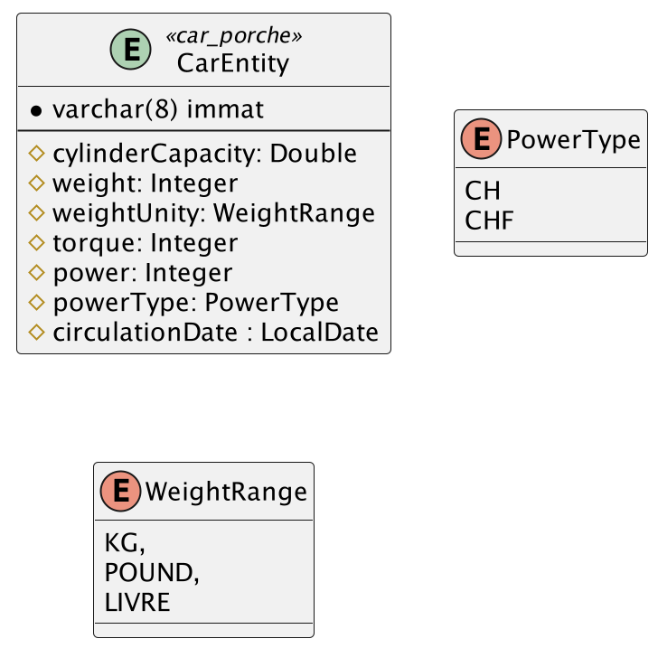

# <u>L3 Miage - BDD -TP1 - EXO1</u>

* Pour pouvoir démarrer tous les TP de manières simples, veilliez vous assurer que vous avez tous les prérequis :
    * voir les [prérequis](prerequis.md)

# Objectif de l'exercice :

Dans cet exercice vous allez de voir apprendre à :

* mapper des tables existantes en entity JPA
* générer des tables grâce à la déclaration des entity JPA

## 1 Définition d'une entity avec une table déjà existante

***Mettre une phrases d'accroche***


### 1.1 `@Table` & `@Entity`

Dans un premier temps, nous allons déclarer la class correspondante :

* Dans le package `fr.uga.l3miage.tp1.exo1.models` nous allons déclarer une nouvelle class `CarEntity`

```java
public class CarEntity {
}
```

* ensuite nous allons utiliser les annotations disponible de JPA afin de correspondre au model ci-dessus :
    * nous allons donc rajouter l'annotation à la classe
      ```java
          @Entity
          public class CarEntity{}
      ```

      afin de dire que cette classe correspond à une table dans la base de données.
    * nous allons ensuite ajouter l'annotation à la classe
      ```java
      @Entity
      @Table(name="car_porshe")
      public class CarEntity{}
      ```
      pour déterminer que l'entité que nous sommes en train de définir correspond à la table `car_porshe` en base de
      données.

### 1.2 `@Id`

À ce stade du Tp, votre éditeur de code devrais vous signalez un problème sur l'entité `CarEntity`.
Effectivement si l'on regarde sur le modèle ([carEntity](#1-définition-dune-entity-avec-une-table-déjà-existante)) l'attribue `immat` correspond à la clé primaire (PK).

### 1.2 `@Column`

L'annotation `@Column` nous permet de définir à quoi corresponde les champs de la classe dans la table en BD.
ainsi qu'a précisé certaines informations sur la colonne en elle-même (sa taille, son format, etc.)

Donc si on reprend la définition de notre classe `CarEntity` nous devons déclarer petit à petits les champs de notre
classe:

* pour le champ `immat` :
  ```java
    @Entity
    @Table(name="car_porshe")
    public class CarEntity{
        @Column(name = "immat",length = 8)
        private String immatriculation;
    }
  ```
  Ici, nous précisons que le champ `immatriculation` de la classe `CarEntity` correspond à la colonne `immat` en base de
  données.

  De plus nous donnons l'indication que la taille de cet attribue ne peux pas excéder 8 grace au <p style="color:green">
  length=8</p>

* pour le champ `cylinderCapacity` :
  De la même manière que pour le champ `immat`, nous ajoutons l'attribue avec l'annotation `@Column`
  ```java
    @Entity
    @Table(name="car_porshe")
    public class CarEntity{
        //Before
        @Column(name = "cylinder_capacity")
        private Double cylinderCapacity;
        //After
    }
  ```
* Ensuite nous allons répéter le process petit à petit pour tous les champs :
    * `weight`
        * ```java
            @Column(name = "weight")
            private Integer weight;
          ```
    * `torque`
        *   ```java
            @Column(name = "torque")
            private Integer torque;
            ```
    * `power`
        * ```java
            @Column(name ="power")
            private Integer power;
          ```
    * `circulationDate`
        *   ```java
            @Column(name= "circulation_date")
            private LocalDate circulationDate;
            ```

### 1.3 Les types `Enum`

Dans l'entité CarEntity, il y a 2 enum :

* `PowerType`
* `WeightType`

Il sont réprésenter de la manière suivante en BD :

* `PowerType` est un entier (`integer`)
    
* `WeightType` est une chaine de caractère(`varchar(255)`)
    

Donc vous vous doutez bien que la gestion d'un enum est particulier en JPA !

#### 1.3.1 Déclaration des types enum

Avant toutes choses déclarons les 2 types enum dans le package `fr.uga.l3miage.tp1.exo1.enums`
de cette manière : 
* `PowerType`
    ```java
    public enum PowerType {
        CH, // type en chevaux
        CHF // type en chevaux fiscaux
    }
    ```
* `WeightRange`
    ```java
    public enum WeightUnity {
        KG, // unité en européen
        POUND, // unité anglaise
        LIVRE // unité anglaise
    }
    ```

#### 1.3.2 @Enumerated

L'annotation `@Enumerated` donne l'indication à JPA que le champ qui contient cette annotation est un type énuméré.
Cette annotation attend 1 argument `EnumType` qui correspond à comment gérer l'enum en base de donnée :

* `EnumType.ORDINAL`: donne l'indication de représenter l'enum en un entier dans la base de données
* `EnumType.STRING`: donne l'indication de représenter l'enum de manière textuelle (string)  dans la base de donnée.

#### 1.3.3 Les types enum dans l'entité `CarEntity`

Donc après avoir compris comment fonctionne les types enum en JPA nous pouvons donc déclarer les attribues `powerType`
et `weightType`.

Comme énoncé précédemment, l'attribue `powerType` est en type intéger dans la BD.
Donc nous devons le déclarer en `EnumType.ORDINAL` ce qui nous donne : 
```java
@Column(name = "Power_type")
@Enumerated(EnumType.ORDINAL)
private PowerType puissanceType;
```
Attention : n'oublié pas le `@Column`

Ensuite, nous pouvons déclarer l'attribue `weightType`, une chaine de caractère en BD. 
Donc à l'inverse, nous allons mtn utiliser `EnumType.STRING`.

```java
@Column(name= "weight_unity")
@Enumerated(EnumType.STRING)
private WeightUnity weightUnity;
```


<html lang="fr">
<div style="background-color: aqua;color: black">
<div>
<h3>Note</h3>
</div>
<aside>
<p style="margin: 10px;color: black">
2 écrire une note avec un peu de style pour expliquer quand on utilise <b>ordinal</b>/ ou non 
</p>
</aside>
</div></html>

#### 1.4.1 @Id

L'annotation `@Id` permet de dire à JPA que l'attribue qui à cette annotation représente la clé primaire en BD. 

Donc dans notre cas, nous devons ajouter : 
```java
@Entity
@Table(name="car_porshe")
public class CarEntity{
    @Id
    @Column(name = "immat",length = 8)
    private String immatriculation;
}
```

### 1.5  À votre tour

Maintenant que vous savez définir une entité, à vous de vous adapter à l'entités `BikeEntity`

### 1.6 Valider votre implémentation


JPA nous permet de valider si nos entités correspondent à la réalité physique en base de données. 
Pour lui permettre cela, nous renseignons la propriété suivante : 
* `spring.jpa.hibernate.ddl-auto` à la valeur `validate`

dans le fichier [application.yml](server/src/main/resources/application.yml)

#### 1.7 lancer la commande

Pour voir si votre implémentation est donc bonne vous devez démarrer le serveur web qui execute JPA (le framework `Spring` dont nous parlerons dans un cours et TP ultérieurement).
```shell
mvn test
```
Ou alors - lancer la classe de test [TestExo1.java](server/src/test/java/fr/uga/l3miage/tp1/exo1/TestExo1.java)


## 2 Définition d'une entité qui n'existe pas en BD

Le gros avantage de JPA, c'est qu'il nous permet aussi de créer le schéma que l'on implémente directement en BD. Il va analyser à son démarrage les entité présente et vas ensuite créer un DDL (Data Definition Langage) et l'exécuter.

Dans cette partie du TP, nous allons observer, comment JPA créer les entités lorsqu'ils sont scannées.

### 2.1 Setup JPA

Comme énoncé plus haut, pour que JPA nous créée directement nos tables en fonction des entités, nous devons changer la propriété suivante : 
* `spring.jpa.hibernate.ddl-auto` à la valeur `create`
  dans le fichier [application.yml](server/src/main/resources/application.yml)

#### Note : 
* Pour la valeur `spring.jpa.hibernate.ddl-auto`, 5 modes sont possibles :

    |    mode     |                                                  fonction                                                  |
    |:-----------:|:----------------------------------------------------------------------------------------------------------:|
    |   create    |            Permet de créer le schéma détecter en base de donnés au démarrage du serveur spring             |
    | create-drop | même action que create, de plus il vas supprimer toutes les tables en BD lors de l'arrêt du serveur spring |
    |   update    | Fait une comparaison entre le modèles JPA et le modèles physique et applique les modification nécessaires  |
    |  validate   |                   Permet de valider si le modèle JPA correspond au modèle physique en BD                   |
    |    none     |                                                ne fait rien                                                |

### 2.2 Ajout d'une nouvelle classe

Ajouter ces nouvelles classe dans le package `fr.uga.l3miage.tp1.exo1.models` : 
⚠️ ne la modifiez pas c'est important

```java
@Entity
public class ClassTestJPA {
    @Id
    private String monIdTest;
    
    private Double jpaSeed;
    
    private LocalDate savedAt;
    
    private PowerType powerType;
}
```

```java
@Entity
public class ClassTestJPA2 {
    @Id
    private String monIdTest;
    
    @Column(unique)
    private String testName;
    
    @Column(precision = 1)
    private Double jpaSeed;
    
    @Column(columnDefinition = "datetimeoffset")
    private Date savedAt;
}
```

### 2.3 Créer les classes

Pour cela et bien rien de plus simple, il vous suffit de démarrer le serveur spring, car puisque vous avez changé la propriété `spring.jpa.hibernate.ddl-auto` à `create`, alors Jpa va s'en charger.

#### 2.3.1 Lancer via Intellij

#### 2.3.1 Lancer via CMD


### 2.4 Voir l'état de votre BD

Pour cela référer vous à la doc des [prérequis](prerequis.md) et allez voir sur `pgAdmin` votre BD

### 2. Questions

1. Décrivez ce que vous observez en base de données lorsque l'on déclare une class comme `ClassTestJPA` ?
2. Quelle sont les effets des propriétés ajouter au @Column dans la classe `ClassTestJPA2`
3. À votre avis dans quels cas il est nécessaire de mettre les annotations `@Column`


---
# <div style="text-align: center;">Fin de l'exo 1</div>